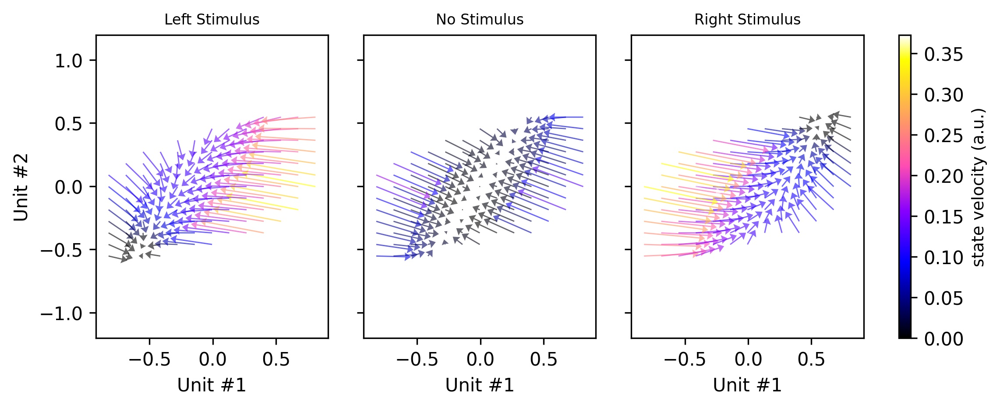

# Reverse-engineering RNN solutions to a hierarchical inference task for mice

Code corresponding to the NeurIPS 2020 paper [Reverse-engineering
Recurrent Neural Network solutions to a hierarchical inference task for mice](https://proceedings.neurips.cc/paper/2020/hash/30f0641c041f03d94e95a76b9d8bd58f-Abstract.html).

### Setup
After cloning the repository, run `pip install -r requirements.txt` to install
the project's dependencies. We used Python 3 and did not test Python 2.

### Running

Our code was written to run on local machine or on a SLURM cluster. There are two main
scripts to run.

1) `train.py`: This will train a RNN with parameters specified inside `utils/params.py`.
During training, two types of objects will be written to disk inside a newly created
`runs/` directory. The first is a TensorBoard
file which logs basic information (e.g. loss, average number of RNN steps per trial,
average fraction of correct actions per trial). The second are model checkpoints through
the training process.

2) `analyze.py`: This will take a trained RNN and generate all the plots contained in the
paper. You'll need to specify the train run id (e.g. `rnn, block_side_probs=0.8, max_stim_strength=2.5_2020-06-18 11:14:27.427969`)
inside `analyze.py`. The plots 
will be written to disk inside that run directory, in a newly created directory named 
`analyze`. A PDF containing all the images will also be generated, in case you want to 
send them all to someone simultaneously.

If you want to run on a SLURM cluster, use the `ann-rnn.sh` bash script.

### Notes and Warnings

- If you want to run analyze, depending on how many blocks you want to average over,
the run may take a very long time. This is likely due to fitting the traditionally 
distilled model (see `utils.analysis.distill_model_traditional()`). However, the model
will be written to disk so that subsequent runs will take less time.

- Some of the variable names are inconsistent throughout the repo
 because our understanding evolved as the project progressed. Sadly, I haven't
 had time to rename variables for reader clarity.

- There are also remnants of directions we never explored. For instance, we considered
playing with different parameter initializations and connectivity constraints (masks)
but these were never actually used. 

### Questions? Concerns? Collaborations?

We'd be delighted to hear from you. Email Rylan Schaeffer at rylanschaeffer@g.harvard.edu 
and cc Ila Fiete at fiete@mit.edu.
